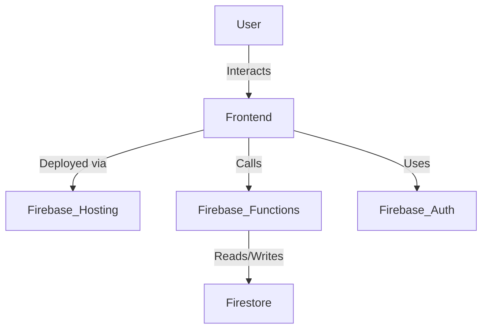

# SANDEEP ENTERPRISES CRM SYSTEM

A full-featured **Customer Relationship Management (CRM)** web application built with **React**, **Firebase**, and **Tailwind CSS**, designed for service engineers and administrators to manage jobs, track service calls, and generate reports efficiently.

---

## Features

- **Authentication** – Role-based access using Firebase Auth (Engineer/Admin)
- **Job Management** – Assign, track, and update jobs with real-time sync
- **PDF Reports** – Generate service job reports dynamically
- **Search & Filter** – Quickly find jobs by status
- **Mobile Responsive** – Optimized UI/UX across all devices
- **Spare Tracking** – Record parts/spares used per job
- **Cloud Hosted** – Deployed on Firebase Hosting

---

## UI Previews

### Login Page


### Dashboard (Owner)


### My Jobs Panel (Engineer)


### Create Job (Owner, Coordinator)


### Downloadable PDF Report


---

## Architecture Overview



---

## Folder Structure

```
frontend/
├── .firebase/               # Firebase config and deploy metadata
├── dist/                   # Production build output
├── functions/              # Firebase cloud functions (optional)
├── node_modules/
├── public/                 # Public assets (favicon, logo etc.)
├── src/
│   ├── assets/             # Static assets like logos/images
│   ├── components/
│   │   ├── layouts/        # Layout components like NavBar
│   │   └── pages/          # Page-level React components
│   ├── context/            # Context providers (e.g., AuthContext)
│   ├── firebase/           # Firebase configuration
│   └── routes/             # React router setup
├── .env                    # Environment variables
├── .firebaserc             # Firebase project aliasing
├── .gitignore
├── index.html              # App root HTML
├── main.jsx                # App bootstrap
├── vite.config.js          # Vite build config
├── package.json
└── README.md

```

---

## Installation

### Prerequisites

- Node.js ≥ 18
- Firebase CLI: `npm install -g firebase-tools`

### Setup Instructions

```bash
git clone https://github.com/yourusername/yourrepo.git
cd CRM/frontend
npm install
```

### Firebase Setup

1. Go to [Firebase Console](https://console.firebase.google.com)
2. Create a new project
3. Enable:
   - Authentication (Email/Password)
   - Firestore
   - Hosting
4. Copy your config to `firebaseConfig.js` in `frontend/src/firebase/`

```js
// firebaseConfig.js
export const firebaseConfig = {
  apiKey: "xxx",
  authDomain: "xxx",
  projectId: "xxx",
  storageBucket: "xxx",
  messagingSenderId: "xxx",
  appId: "xxx"
};
```

### Hosting

```bash
npm run build
firebase login
firebase init hosting
firebase deploy --only hosting
```

---

## User Roles

- **Owner**: Full administrative access. Can add Coordinators and Engineers, manage users, and access all parts of the application.
- **Coordinator**: Manages job assignments. Can assign engineers to jobs and close calls, optionally adding claim details.
- **Engineer**: Executes field service jobs. Can view assigned jobs, update job status, remarks, spares used, and download service reports as PDF.

---

## Contact

Built with ❤️ by [Priyanshi Saraf](mailto:priyanshisaraf9@gmail.com)
